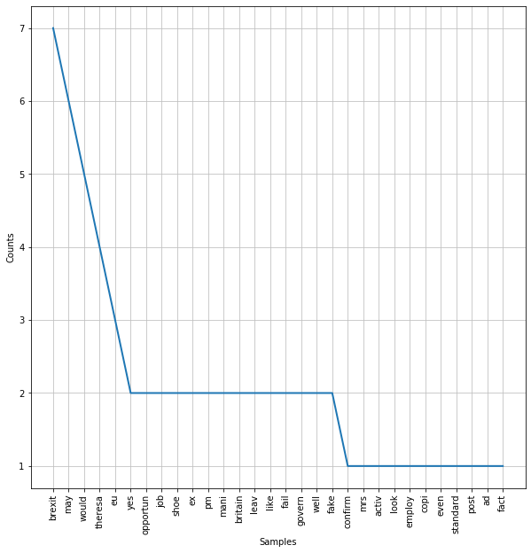
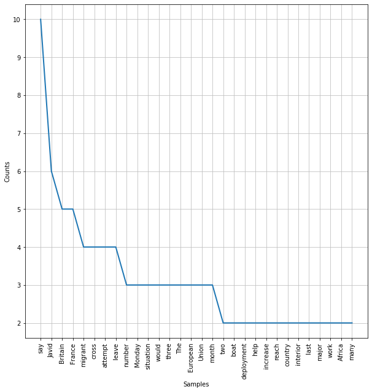

# Agenda today:
1. Overview of NLP
2. Model Building Remains Consistent
2. Pre-Processing for NLP 
    - Tokenization
    - Stopwords removal
    - Lexicon normalization: lemmatization and stemming
3. Feature Engineering for NLP
    - Bag-of-Words
    - Count Vectorizer
    - Term frequency-Inverse Document Frequency (tf-idf)


```python
# This is always a good idea
%load_ext autoreload
%autoreload 2

# This is always a good idea
%load_ext autoreload
%autoreload 2

from src.student_caller import one_random_student
from src.student_list import student_first_names
```

    The autoreload extension is already loaded. To reload it, use:
      %reload_ext autoreload


## 1. Overview of NLP
NLP allows computers to interact with text data in a structured and sensible way. In short, we will be breaking up series of texts into individual words (or groups of words), and isolating the words with **semantic value**.  We will then compare texts with similar distributions of these words, and group them together.

In this section, we will discuss some steps and approaches to common text data analytic procedures. In other words, with NLP, computers are taught to understand human language, its meaning and sentiments. Some of the applications of natural language processing are:
- Chatbots 
- Speech recognition and audio processing 
- Classifying documents 

Here is an example that uses some of the tools we use in this notebook.  
  -[chi_justice_project](https://chicagojustice.org/research/justice-media-project/)  
  -[chicago_justice classifier](https://github.com/chicago-justice-project/article-tagging/blob/master/lib/notebooks/bag-of-words-count-stemmed-binary.ipynb)

We will introduce you to the preprocessing steps, feature engineering, and other steps you need to take in order to format text data for machine learning tasks. 

We will also introduce you to [**NLTK**](https://www.nltk.org/) (Natural Language Toolkit), which will be our main tool for engaging with textual data.

# NLP process 


# 2. Model Building Principles Remain Consistent


```python
#!pip install nltk
# conda install -c anaconda nltk
```

We will be working with a dataset which includes both **satirical** (The Onion) and real news (Reuters) articles. 

### Vocab
> We refer to the entire set of articles as the **corpus**.  


```python
# Let's import our corpus. 
import pandas as pd

```

Our goal is to detect satire, so our target class of 1 is associated with The Onion articles. 

 

This is a highly relavent task.  If we could separate real news from fictitious news, we would be able to potentially flag the latter as such.  This does come with risks.  If we deploy a model which mislabel real news as ficticious news, we will open ourselves to all sorts of criticism.  A false positive in this sense to bury a story or do damage to a reporter's reputation. 

#### More Vocab
> Each article in the corpus is refered to as a **document**.


```python
# How many documents are there in the corpus?
```


```python
# What is the class balance?
```


```python
# Let's look at some example texts from both categories

# Category 1

```


```python
# Category 0
```

Let's think about our types of error and the use cases of being able to correctly separate satirical from authentic news. What type of error should we decide to optimize our models for?  


```python
# Help me fill in the blanks:

# Pass in the body of the documents as raw text
X = None
y = None
```


```python
from sklearn.model_selection import train_test_split
X_train, X_test, y_train, y_test = train_test_split(X, y, random_state=42, test_size=.2)
```


```python
# For demonstration purposes, we will perform a secondary train test split. In practice, we will apply a pipeline.

X_t, X_val, y_t, y_val = train_test_split(X_train, y_train, random_state=42, test_size=.2)

```


```python
from sklearn.feature_extraction.text import TfidfVectorizer

# A new preprocessing tool!
tfidf = TfidfVectorizer(token_pattern=r"([a-zA-Z]+(?:'[a-z]+)?)")

# Like always, we are fitting only on the training set
X_t_vec = None

# Here is our new dataframe of predictors
X_t_vec = pd.DataFrame(X_t_vec.toarray(), columns = tfidf.get_feature_names())

X_t_vec.head()
```


    ---------------------------------------------------------------------------

    AttributeError                            Traceback (most recent call last)

    <ipython-input-47-216d598a5d82> in <module>
          8 
          9 # Here is our new dataframe of predictors
    ---> 10 X_t_vec = pd.DataFrame(X_t_vec.toarray(), columns = tfidf.get_feature_names())
         11 
         12 X_t_vec.head()


    AttributeError: 'NoneType' object has no attribute 'toarray'


```python
# That's a lot of columns
X_t_vec.shape
```


    (640, 18970)


### We can push this data into any of our classification models


```python
# Code here
```

# We proceed as usual:
    - Transform the validation set
    - Score the validation set
    - Plot a confusion matrix to check out the performance on different types of errors
 


```python
# your code here

# Transform X_val
X_val_vec = None

# Score val
y_hat = None

# Plot confusion matrix

```

#### How did your model do?  

Probably well.  
It's pretty amazing the patterns, even a relatively low power one such as logistic regression, can find in text data.

# 3 Preprocessing

### Tokenization 

In order to convert the texts into data suitable for machine learning, we need to break down the documents into smaller parts. 

The first step in doing that is **tokenization**.

Tokenization is the process of splitting documents into units of observations. We usually represent the tokens as __n-gram__, where n represent the consecutive words occuring in a document. In the case of unigram (one word token), the sentence "David works here" can be tokenized into?

"David", "works", "here"
"David works", "works here"

Let's consider the first document in our corpus:


```python
first_document = None
```

There are many ways to tokenize our document. 

It is a long string, so the first way we might consider is to split it by spaces.


```python
# code
```


```python
one_random_student(student_first_names)
```

    Josh


#### Chat out some problems (don't look down)


We are trying to create a set of tokens with **high semantic value**.  In other words, we want to isolate text which best represents the meaning in each document.  


## Common text cleaning tasks:  
  1. remove capitalization  
  2. remove punctuation  
  3. remove stopwords  
  4. remove numbers

We could manually perform all of these tasks with string operations

## Capitalization

When we create our matrix of words associated with our corpus, **capital letters** will mess things up.  The semantic value of a word used at the beginning of a sentence is the same as that same word in the middle of the sentence.  In the two sentences:

sentence_one =  "Excessive gerrymandering in small counties suppresses turnout."   
sentence_two =  "Turnout is suppressed in small counties by excessive gerrymandering."  

Excessive has the same semantic value, but will be treated as two separate tokens because of capitals.


```python
sentence_one =  "Excessive gerrymandering in small counties suppresses turnout." 
sentence_two =  "Turnout is suppressed in small counties by excessive gerrymandering."

```


```python
# Code for Excessive does not equal excessive

```

### Let's fill in the list comprehension below to manually and remove capitals from the 1st document


```python
manual_cleanup = None
```


```python
print(f"Our initial token set for our first document is {len(manual_cleanup)} words long")
```

    Our initial token set for our first document is 154 words long


```python
print(f"Our initial token set for our first document has {len(set(first_document.split()))} unique words")
```

    Our initial token set for our first document has 117 unique words


```python
print(f"After remove caps, our first document has {len(set(manual_cleanup))} unique words")
```

    After remove caps, our first document has 115 unique words


By removing capitals, we decrease the total unique word count in our first document by 2.  That may not seem like much, but across an entire corpus, it will make a big difference.

## Punctuation

Like capitals, splitting on white space will create tokens which include punctuation that will muck up our semantics.  

Returning to the above example, 'gerrymandering' and 'gerrymandering.' will be treated as different tokens.


```python
sentence_one =  "Excessive gerrymandering in small counties suppresses turnout." 
sentence_two =  "Turnout is suppressed in small counties by excessive gerrymandering."
```


```python
# Code to show our computer differentiates between the same word with different punctuations
```

# Different ways to strip punctuation


```python
# Strip with translate

## Manual removal of punctuation
# string library!
import string

string.punctuation
punctuation = string.punctuation + '“'
punctuation
# string.ascii_letters


```


    '!"#$%&\'()*+,-./:;<=>?@[\\]^_`{|}~“'


# Strip with regex

To remove them, we will use regular expressions, a powerful tool which you may already have some familiarity with.

Regex allows us to match strings based on a pattern.  This pattern comes from a language of identifiers, which we can begin exploring on the cheatsheet found here:
  -   https://regexr.com/

A few key symbols:
  - . : matches any character
  - \d, \w, \s : represent digit, word, whitespace  
  - *, ?, +: matches 0 or more, 0 or 1, 1 or more of the preceding character  
  - [A-Z]: matches any capital letter  
  - [a-z]: matches lowercase letter  

Other helpful resources:

https://regexcrossword.com/  
https://www.regular-expressions.info/tutorial.html


```python
import re
# Test out a word and search it

# Create a pattern that matches only letters to strip punctuation
pattern = None

# Use re.search to search for a word.
target_word = manual_cleanup[10]

# Use the .group() method to return the matched word


```


```python
# Use a list comprehension to search each word in the word list and return the match.
# Use an if statement to make sure the .group() method does not throw an error.

# Code here
```


```python
print(f"After removing punctuation, our first document has {len(set(manual_cleanup))} unique words")
```

    After removing punctuation, our first document has 107 unique words


### Stopwords

Stopwords are the **filler** words in a language: prepositions, articles, conjunctions. They have low semantic value, and almost always need to be removed.  

Luckily, NLTK has lists of stopwords ready for our use.


```python
stopwords.words('english')[:10]

# Try other langauges below
```


    ['i', 'me', 'my', 'myself', 'we', 'our', 'ours', 'ourselves', 'you', "you're"]


As you notice above, stopwords come from the [nltk corpus package](http://www.nltk.org/book_1ed/ch02.html#tab-corpora).  The corpus package contains a variety of texts that are free to download and use.

Let's see which stopwords are present in our first document.


```python
stops = [token for token in manual_cleanup if token in stopwords.words('english')]

```


```python
stops = [token for token in manual_cleanup if token in stopwords.words('english')]
stops[:10]
```


    ['that', 'the', 'of', 'as', 'of', 'the', 'of', 'the', 'in', 'than']


```python
print(f'There are {len(stops)} stopwords in the first document')
```

    There are 68 stopwords in the first document


```python
print(f'That is {len(stops)/len(manual_cleanup): .2%} of our text')
```

    That is  44.44% of our text


Let's also use the **FreqDist** tool to look at the makeup of our text before and after removal


```python
from nltk.probability import FreqDist
import matplotlib.pyplot as plt
```


```python
manual_cleanup = [token for token in manual_cleanup if token not in stopwords.words('english')]
```


```python
# We can also customize our stopwords list
```


```python
manual_cleanup = [token for token in manual_cleanup if token not in custom_sw]

```


```python
print(f'After removing stopwords, there are {len(set(manual_cleanup))} unique words left')
```

    After removing stopwords, there are 74 unique words left


```python
fdist = FreqDist(manual_cleanup)
plt.figure(figsize=(10,10))
fdist.plot(30)
```


    <matplotlib.axes._subplots.AxesSubplot at 0x1a70f30860>


```python
# From the Frequency Dist plot, there are perhaps some more stopwords we can remove

```

#### Numbers

Numbers also usually have low semantic value. Their removal can help improve our models. 

To remove them, we will use regular expressions, a powerful tool which you may already have some familiarity with.

Bringing back our regex symbols, we can quickly figure out patterns which will filter out numeric values.

A few key symbols:
  - . : matches any character
  - \d, \w, \s : represent digit, word, whitespace  
  - *, ?, +: matches 0 or more, 0 or 1, 1 or more of the preceding character  
  - [A-Z]: matches any capital letter  
  - [a-z]: matches lowercase letter  


```python
# pattern to remove numbers (probably same as above)

no_num_pattern = None

test_string = "Reno 911"

re.search(no_num_pattern, test_string).group()

```


    ---------------------------------------------------------------------------

    TypeError                                 Traceback (most recent call last)

    <ipython-input-144-5a81b77bcf83> in <module>
          5 test_string = "Reno 911"
          6 
    ----> 7 re.search(no_num_pattern, test_string).group()
    

    ~/anaconda3/lib/python3.7/re.py in search(pattern, string, flags)
        181     """Scan through string looking for a match to the pattern, returning
        182     a Match object, or None if no match was found."""
    --> 183     return _compile(pattern, flags).search(string)
        184 
        185 def sub(pattern, repl, string, count=0, flags=0):


    ~/anaconda3/lib/python3.7/re.py in _compile(pattern, flags)
        283         return pattern
        284     if not sre_compile.isstring(pattern):
    --> 285         raise TypeError("first argument must be string or compiled pattern")
        286     p = sre_compile.compile(pattern, flags)
        287     if not (flags & DEBUG):


    TypeError: first argument must be string or compiled pattern


# Pair Exercise:  
Sklearn and NLTK provide us with a suite of **tokenizers** for our text preprocessing convenience.


```python
import nltk
from nltk.tokenize import regexp_tokenize, word_tokenize, RegexpTokenizer

```

We can use them to condense the steps above.  As we will see, even more steps will be condensed in the vectorizors introduced at the end of the notebook.  

For now, we will still need to make our list lowercase and remove stopwords by hand. 

It is important to get used to the process of tokenizing by hand, since it will give us more freedom in certain preprocessing steps (see stemmers/lemmers below).

For this exercise, take the sample_doc below and use the tokenizer of your choice to create word tokens.  If you use the regexp vectorizor, I have included a regex pattern that does not exclude contractions.  Feel free to pass that in as an argument.

After tokenizing, make tokens lowercase, and remove stopwords.


```python
sample_doc = X_t.sample(random_state=42).values[0]
sample_doc
```


    '“Yes, we can confirm that Mrs. May is actively looking for other employment opportunities. She has a copy of the Evening Standard where they post some job ads. In fact, there is one job she is applying to, and that is a shoe saleswoman in Barking, East London. This would be a great opportunity for the ex-PM to be around what she loves, shoes.” The final nail in the coffin for many was Theresa May approving that the European Courts of Justice would have full jurisdiction in Britain after Brexit. This is tantamount to Britain not leaving the EU at all. The soon-to-be ex-PM also conceded to pay Brussels whatever they want with a 100 billion euro payment, of course taken out of the purse of the British taxpayer. This blackmail ransom money could have easily been avoided by not pandering to the EU’s ridiculous demands and simply leaving the talks. Instead, Theresa May lifted up her skirt, bent over the table and was used like a piece of sallow rotting meat by EU eurocrats. In a failed Brexit, led by Remainers, what did you expect? So, what happens when Theresa May is shown the door? Yes, there could be another impromptu general election, which would no doubt bring in Comrade Corbyn. In a weird, anarchic sense, this would be a fitting end to a Brexit that is not really a Brexit but one only by name. We would naturally have anarchy in the streets, massive chaos in government, banking services completely disrupted and stripped of their privileges, and a royal family on the run, turfed out of their palaces by the people’s army and Momentum. What about the other Brexiteers in the Tory government? Well, according to many voters, they did not have the balls to stand up to Theresa May when she was in power, therefore they failed their country miserably. They may call themselves Brexiteers, however, they are, much like the fake Brexit we are being delivered, fake as well.'


```python
import re
re.findall(r"([a-zA-Z]+(?:'[a-z]+)?)" , "I'd")
```


    ["I'd"]


```python
# your code here

# Use the tokenizer of your choice using the .tokenize() method.
tokenizer = None

# make lowercase

# remove stopwords


```


```python
print(f'We are down to {len(set(sample_doc))} unique words')
```

    We are down to 141 unique words


# Stemming

Most of the semantic meaning of a word is held in the root, which is usually the beginning of a word.  Conjugations and plurality do not change the semantic meaning. "eat", "eats", and "eating" all have essentially the same meaning packed into eat.   

Stemmers consolidate similar words by chopping off the ends of the words.


There are different stemmers available.  The two we will use here are the **Porter** and **Snowball** stemmers.  A main difference between the two is how agressively it stems, Porter being less agressive.


```python
from nltk.stem import *

# instantiate a PorterStemmer and a SnowballStemmer.  Pass language='english' as an argument to the Snowball
```


```python
# using the .stem() method, try out stemming some words from the sample doc

```


    'confirm'


```python
difference_count = 0
for word in sample_doc:
    p_word = p_stemmer.stem(word)
    s_word = s_stemmer.stem(word)
    
    if p_word != s_word:
        print(p_word, s_word)
        difference_count += 1
        
print("\n" f"Of the {len(sample_doc)} words in the sample doc, only {difference_count} are stemmed differently")
    
```

    ye yes
    mr mrs
    eu’ eu
    ye yes
    gener general
    people’ peopl
    
    Of the 171 words in the sample doc, only 6 are stemmed differently


```python
# Let's use the snowball stemmer, and stem all the words in the doc

```


```python
fdist = FreqDist(sample_doc)
plt.figure(figsize=(10,10))
fdist.plot(30)
```





    <matplotlib.axes._subplots.AxesSubplot at 0x1a2adfd400>


```python
print(f'Stemming reduced our token count {len(set(sample_doc))} to unique tokens')
```

    Stemming reduced our token count 137 to unique tokens


# Lemming

Lemming is a bit more sophisticated that the stem choppers.  Lemming uses part of speech tagging to determine how to transform a word.  In that 
Lemmatization returns real words. For example, instead of returning "movi" like Porter stemmer would, "movie" will be returned by the lemmatizer.

- Unlike Stemming, Lemmatization reduces the inflected words properly ensuring that the root word belongs to the language.  It can handle words such as "mouse", whose plural "mice" the stemmers would not lump together with the original. 

- In Lemmatization, the root word is called Lemma. 

- A lemma (plural lemmas or lemmata) is the canonical form, dictionary form, or citation form of a set of words.


```python
from nltk.stem import WordNetLemmatizer 
  
# instantiate a lemmatizer
lemmatizer = None
```


```python
# think of a noun with an irregular plural form and pass the string as an argument to the lemmatizer
print(f'<Irregular noun> becomes: {lemmatizer.lemmatize()}')

```


    ---------------------------------------------------------------------------

    TypeError                                 Traceback (most recent call last)

    <ipython-input-231-55794db2d676> in <module>
          1 # think of a noun with an irregular plural form and pass the string as an argument to the lemmatizer
    ----> 2 print(f'<Irregular noun> becomes: {lemmatizer.lemmatize()}')
    

    TypeError: lemmatize() missing 1 required positional argument: 'word'


```python
new_sample = X_t.sample().values[0]
tokenizer = RegexpTokenizer(r"([a-zA-Z]+(?:[’'][a-z]+)?)")

new_sample = tokenizer.tokenize(new_sample)
new_sample
```


    ['Britain',
     'is',
     'recalling',
     'two',
     'patrol',
     'boats',
     'from',
     'overseas',
     'deployments',
     'to',
     'help',
     'deal',
     'with',
     'an',
     'increase',
     'in',
     'the',
     'number',
     'of',
     'migrants',
     'trying',
     'to',
     'reach',
     'the',
     'country',
     'from',
     'France',
     'interior',
     'minister',
     'Sajid',
     'Javid',
     'said',
     'on',
     'Monday',
     'Javid',
     'said',
     'there',
     'had',
     'been',
     'an',
     'increase',
     'in',
     'the',
     'number',
     'of',
     'migrants',
     'crossing',
     'the',
     'English',
     'Channel',
     'from',
     'France',
     'and',
     'last',
     'week',
     'he',
     'declared',
     'the',
     'situation',
     'a',
     'major',
     'incident',
     'On',
     'Monday',
     'following',
     'a',
     'meeting',
     'of',
     'officials',
     'in',
     'London',
     'he',
     'said',
     'two',
     'the',
     'additional',
     'ships',
     'would',
     'join',
     'three',
     'other',
     'vessels',
     'already',
     'working',
     'in',
     'the',
     'channel',
     'He',
     'said',
     'migrants',
     'had',
     'attempted',
     'to',
     'cross',
     'one',
     'of',
     'the',
     'world’s',
     'busiest',
     'shipping',
     'lanes',
     'in',
     'December',
     'although',
     'almost',
     'half',
     'were',
     'prevented',
     'from',
     'leaving',
     'France',
     'The',
     'number',
     'is',
     'a',
     'tiny',
     'fraction',
     'of',
     'those',
     'regularly',
     'attempting',
     'to',
     'reach',
     'European',
     'Union',
     'territory',
     'by',
     'crossing',
     'the',
     'Mediterranean',
     'from',
     'northern',
     'Africa',
     'and',
     'Turkey',
     'many',
     'of',
     'whom',
     'are',
     'fleeing',
     'conflict',
     'and',
     'poverty',
     'in',
     'the',
     'Middle',
     'East',
     'and',
     'Africa',
     'But',
     'their',
     'attempts',
     'to',
     'cross',
     'into',
     'Britain',
     'have',
     'attracted',
     'extensive',
     'domestic',
     'scrutiny',
     'amid',
     'a',
     'febrile',
     'political',
     'atmosphere',
     'less',
     'than',
     'three',
     'months',
     'before',
     'Britain',
     'leaves',
     'the',
     'European',
     'Union',
     'after',
     'a',
     'referendum',
     'in',
     'which',
     'immigration',
     'was',
     'a',
     'major',
     'theme',
     'This',
     'will',
     'help',
     'both',
     'with',
     'the',
     'human',
     'side',
     'of',
     'this',
     'situation',
     'but',
     'also',
     'to',
     'better',
     'protect',
     'our',
     'borders',
     'Javid',
     'said',
     'of',
     'the',
     'deployment',
     'The',
     'last',
     'three',
     'months',
     'accounted',
     'for',
     'around',
     'percent',
     'of',
     'all',
     'attempts',
     'in',
     'Javid',
     'said',
     'adding',
     'crossings',
     'were',
     'up',
     'in',
     'compared',
     'to',
     'The',
     'interior',
     'ministry',
     'said',
     'the',
     'majority',
     'of',
     'those',
     'who',
     'had',
     'arrived',
     'in',
     'Britain',
     'in',
     'the',
     'recent',
     'period',
     'were',
     'Iranian',
     'but',
     'said',
     'it',
     'did',
     'not',
     'routinely',
     'publish',
     'data',
     'and',
     'would',
     'not',
     'be',
     'providing',
     'a',
     'running',
     'tally',
     'or',
     'exact',
     'comparisons',
     'with',
     'previous',
     'years',
     'Local',
     'media',
     'reported',
     'that',
     'people',
     'arrived',
     'at',
     'a',
     'beach',
     'in',
     'southeast',
     'England',
     'by',
     'small',
     'boat',
     'on',
     'Monday',
     'Javid',
     'cut',
     'short',
     'a',
     'holiday',
     'to',
     'oversee',
     'the',
     'response',
     'to',
     'the',
     'situation',
     'and',
     'is',
     'seen',
     'as',
     'one',
     'of',
     'those',
     'jostling',
     'to',
     'replace',
     'Prime',
     'Minister',
     'Theresa',
     'May',
     'after',
     'she',
     'said',
     'earlier',
     'this',
     'month',
     'she',
     'would',
     'step',
     'down',
     'before',
     'the',
     'next',
     'scheduled',
     'nation',
     'election',
     'in',
     'Concern',
     'over',
     'both',
     'legal',
     'migration',
     'and',
     'illegal',
     'immigration',
     'was',
     'seen',
     'as',
     'an',
     'important',
     'driver',
     'of',
     'the',
     'vote',
     'to',
     'leave',
     'the',
     'European',
     'Union',
     'I',
     'don’t',
     'want',
     'people',
     'to',
     'think',
     'that',
     'if',
     'they',
     'leave',
     'a',
     'safe',
     'country',
     'like',
     'France',
     'that',
     'they',
     'can',
     'get',
     'to',
     'Britain',
     'and',
     'just',
     'get',
     'to',
     'stay',
     'Javid',
     'said',
     'outlining',
     'a',
     'desire',
     'to',
     'work',
     'with',
     'France',
     'to',
     'return',
     'as',
     'many',
     'of',
     'the',
     'migrants',
     'as',
     'possible']


```python
print(f'{new_sample[8]} becomes: {lemmatizer.lemmatize(new_sample[8])}')
```

    deployments becomes: deployment


```python
# However, look at the output below:
    
sentence = "He saw the trees get sawed down"
lemmed_sentence = [lemmatizer.lemmatize(token) for token in sentence.split(' ')]
lemmed_sentence
```


    ['He', 'saw', 'the', 'tree', 'get', 'sawed', 'down']


```python
one_random_student(student_first_names)
# What should have changed form but didn't?
```

    Jeffrey


Lemmatizers depend on POS tagging, and defaults to noun.

With a little bit of work, we can POS tag our text.


```python
pattern = "([a-zA-Z]+(?:'[a-z]+)?)"
tokenizer = RegexpTokenizer(r"([a-zA-Z]+(?:[’'][a-z]+)?)")
new_sample = [token for token in new_sample if token not in custom_sw]
new_sample
```


    ['Britain',
     'recalling',
     'two',
     'patrol',
     'boats',
     'overseas',
     'deployments',
     'help',
     'deal',
     'increase',
     'number',
     'migrants',
     'trying',
     'reach',
     'country',
     'France',
     'interior',
     'minister',
     'Sajid',
     'Javid',
     'said',
     'Monday',
     'Javid',
     'said',
     'increase',
     'number',
     'migrants',
     'crossing',
     'English',
     'Channel',
     'France',
     'last',
     'week',
     'declared',
     'situation',
     'major',
     'incident',
     'On',
     'Monday',
     'following',
     'meeting',
     'officials',
     'London',
     'said',
     'two',
     'additional',
     'ships',
     'would',
     'join',
     'three',
     'vessels',
     'already',
     'working',
     'channel',
     'He',
     'said',
     'migrants',
     'attempted',
     'cross',
     'world’s',
     'busiest',
     'shipping',
     'lanes',
     'December',
     'although',
     'almost',
     'half',
     'prevented',
     'leaving',
     'France',
     'The',
     'number',
     'tiny',
     'fraction',
     'regularly',
     'attempting',
     'reach',
     'European',
     'Union',
     'territory',
     'crossing',
     'Mediterranean',
     'northern',
     'Africa',
     'Turkey',
     'many',
     'fleeing',
     'conflict',
     'poverty',
     'Middle',
     'East',
     'Africa',
     'But',
     'attempts',
     'cross',
     'Britain',
     'attracted',
     'extensive',
     'domestic',
     'scrutiny',
     'amid',
     'febrile',
     'political',
     'atmosphere',
     'less',
     'three',
     'months',
     'Britain',
     'leaves',
     'European',
     'Union',
     'referendum',
     'immigration',
     'major',
     'theme',
     'This',
     'help',
     'human',
     'side',
     'situation',
     'also',
     'better',
     'protect',
     'borders',
     'Javid',
     'said',
     'deployment',
     'The',
     'last',
     'three',
     'months',
     'accounted',
     'around',
     'percent',
     'attempts',
     'Javid',
     'said',
     'adding',
     'crossings',
     'compared',
     'The',
     'interior',
     'ministry',
     'said',
     'majority',
     'arrived',
     'Britain',
     'recent',
     'period',
     'Iranian',
     'said',
     'routinely',
     'publish',
     'data',
     'would',
     'providing',
     'running',
     'tally',
     'exact',
     'comparisons',
     'previous',
     'years',
     'Local',
     'media',
     'reported',
     'people',
     'arrived',
     'beach',
     'southeast',
     'England',
     'small',
     'boat',
     'Monday',
     'Javid',
     'cut',
     'short',
     'holiday',
     'oversee',
     'response',
     'situation',
     'seen',
     'jostling',
     'replace',
     'Prime',
     'Minister',
     'Theresa',
     'May',
     'said',
     'earlier',
     'month',
     'would',
     'step',
     'next',
     'scheduled',
     'nation',
     'election',
     'Concern',
     'legal',
     'migration',
     'illegal',
     'immigration',
     'seen',
     'important',
     'driver',
     'vote',
     'leave',
     'European',
     'Union',
     'I',
     'don’t',
     'want',
     'people',
     'think',
     'leave',
     'safe',
     'country',
     'like',
     'France',
     'get',
     'Britain',
     'get',
     'stay',
     'Javid',
     'said',
     'outlining',
     'desire',
     'work',
     'France',
     'return',
     'many',
     'migrants',
     'possible']


```python
nltk.download('tagsets')
nltk.help.upenn_tagset()
```

    $: dollar
        $ -$ --$ A$ C$ HK$ M$ NZ$ S$ U.S.$ US$
    '': closing quotation mark
        ' ''
    (: opening parenthesis
        ( [ {
    ): closing parenthesis
        ) ] }
    ,: comma
        ,
    --: dash
        --
    .: sentence terminator
        . ! ?
    :: colon or ellipsis
        : ; ...
    CC: conjunction, coordinating
        & 'n and both but either et for less minus neither nor or plus so
        therefore times v. versus vs. whether yet
    CD: numeral, cardinal
        mid-1890 nine-thirty forty-two one-tenth ten million 0.5 one forty-
        seven 1987 twenty '79 zero two 78-degrees eighty-four IX '60s .025
        fifteen 271,124 dozen quintillion DM2,000 ...
    DT: determiner
        all an another any both del each either every half la many much nary
        neither no some such that the them these this those
    EX: existential there
        there
    FW: foreign word
        gemeinschaft hund ich jeux habeas Haementeria Herr K'ang-si vous
        lutihaw alai je jour objets salutaris fille quibusdam pas trop Monte
        terram fiche oui corporis ...
    IN: preposition or conjunction, subordinating
        astride among uppon whether out inside pro despite on by throughout
        below within for towards near behind atop around if like until below
        next into if beside ...
    JJ: adjective or numeral, ordinal
        third ill-mannered pre-war regrettable oiled calamitous first separable
        ectoplasmic battery-powered participatory fourth still-to-be-named
        multilingual multi-disciplinary ...
    JJR: adjective, comparative
        bleaker braver breezier briefer brighter brisker broader bumper busier
        calmer cheaper choosier cleaner clearer closer colder commoner costlier
        cozier creamier crunchier cuter ...
    JJS: adjective, superlative
        calmest cheapest choicest classiest cleanest clearest closest commonest
        corniest costliest crassest creepiest crudest cutest darkest deadliest
        dearest deepest densest dinkiest ...
    LS: list item marker
        A A. B B. C C. D E F First G H I J K One SP-44001 SP-44002 SP-44005
        SP-44007 Second Third Three Two * a b c d first five four one six three
        two
    MD: modal auxiliary
        can cannot could couldn't dare may might must need ought shall should
        shouldn't will would
    NN: noun, common, singular or mass
        common-carrier cabbage knuckle-duster Casino afghan shed thermostat
        investment slide humour falloff slick wind hyena override subhumanity
        machinist ...
    NNP: noun, proper, singular
        Motown Venneboerger Czestochwa Ranzer Conchita Trumplane Christos
        Oceanside Escobar Kreisler Sawyer Cougar Yvette Ervin ODI Darryl CTCA
        Shannon A.K.C. Meltex Liverpool ...
    NNPS: noun, proper, plural
        Americans Americas Amharas Amityvilles Amusements Anarcho-Syndicalists
        Andalusians Andes Andruses Angels Animals Anthony Antilles Antiques
        Apache Apaches Apocrypha ...
    NNS: noun, common, plural
        undergraduates scotches bric-a-brac products bodyguards facets coasts
        divestitures storehouses designs clubs fragrances averages
        subjectivists apprehensions muses factory-jobs ...
    PDT: pre-determiner
        all both half many quite such sure this
    POS: genitive marker
        ' 's
    PRP: pronoun, personal
        hers herself him himself hisself it itself me myself one oneself ours
        ourselves ownself self she thee theirs them themselves they thou thy us
    PRP$: pronoun, possessive
        her his mine my our ours their thy your
    RB: adverb
        occasionally unabatingly maddeningly adventurously professedly
        stirringly prominently technologically magisterially predominately
        swiftly fiscally pitilessly ...
    RBR: adverb, comparative
        further gloomier grander graver greater grimmer harder harsher
        healthier heavier higher however larger later leaner lengthier less-
        perfectly lesser lonelier longer louder lower more ...
    RBS: adverb, superlative
        best biggest bluntest earliest farthest first furthest hardest
        heartiest highest largest least less most nearest second tightest worst
    RP: particle
        aboard about across along apart around aside at away back before behind
        by crop down ever fast for forth from go high i.e. in into just later
        low more off on open out over per pie raising start teeth that through
        under unto up up-pp upon whole with you
    SYM: symbol
        % & ' '' ''. ) ). * + ,. < = > @ A[fj] U.S U.S.S.R * ** ***
    TO: "to" as preposition or infinitive marker
        to
    UH: interjection
        Goodbye Goody Gosh Wow Jeepers Jee-sus Hubba Hey Kee-reist Oops amen
        huh howdy uh dammit whammo shucks heck anyways whodunnit honey golly
        man baby diddle hush sonuvabitch ...
    VB: verb, base form
        ask assemble assess assign assume atone attention avoid bake balkanize
        bank begin behold believe bend benefit bevel beware bless boil bomb
        boost brace break bring broil brush build ...
    VBD: verb, past tense
        dipped pleaded swiped regummed soaked tidied convened halted registered
        cushioned exacted snubbed strode aimed adopted belied figgered
        speculated wore appreciated contemplated ...
    VBG: verb, present participle or gerund
        telegraphing stirring focusing angering judging stalling lactating
        hankerin' alleging veering capping approaching traveling besieging
        encrypting interrupting erasing wincing ...
    VBN: verb, past participle
        multihulled dilapidated aerosolized chaired languished panelized used
        experimented flourished imitated reunifed factored condensed sheared
        unsettled primed dubbed desired ...
    VBP: verb, present tense, not 3rd person singular
        predominate wrap resort sue twist spill cure lengthen brush terminate
        appear tend stray glisten obtain comprise detest tease attract
        emphasize mold postpone sever return wag ...
    VBZ: verb, present tense, 3rd person singular
        bases reconstructs marks mixes displeases seals carps weaves snatches
        slumps stretches authorizes smolders pictures emerges stockpiles
        seduces fizzes uses bolsters slaps speaks pleads ...
    WDT: WH-determiner
        that what whatever which whichever
    WP: WH-pronoun
        that what whatever whatsoever which who whom whosoever
    WP$: WH-pronoun, possessive
        whose
    WRB: Wh-adverb
        how however whence whenever where whereby whereever wherein whereof why
    ``: opening quotation mark
        ` ``


    [nltk_data] Downloading package tagsets to
    [nltk_data]     /Users/johnmaxbarry/nltk_data...
    [nltk_data]   Package tagsets is already up-to-date!


```python
from nltk import pos_tag
# Use nltk's pos_tag to tag our words
# Does a pretty good job, but does make some mistakes

```


```python
# Then transform the tags into the tags of our lemmatizers
from nltk.corpus import wordnet

def get_wordnet_pos(treebank_tag):
    '''
    Translate nltk POS to wordnet tags
    '''
    if treebank_tag.startswith('J'):
        return wordnet.ADJ
    elif treebank_tag.startswith('V'):
        return wordnet.VERB
    elif treebank_tag.startswith('N'):
        return wordnet.NOUN
    elif treebank_tag.startswith('R'):
        return wordnet.ADV
    else:
        return wordnet.NOUN
```


```python
new_sample_tagged = [(token[0], get_wordnet_pos(token[1]))
             for token in new_sample_tagged]
```


```python
# Now lemmatize with the POS fed into the lemmatizer

```


```python
new_sample_lemmed[:10]
```


    ['Britain',
     'recall',
     'two',
     'patrol',
     'boat',
     'overseas',
     'deployment',
     'help',
     'deal',
     'increase']


```python
print(f'There are {len(set(new_sample_lemmed))} unique lemmas')
```

    There are 162 unique lemmas


```python
fdist = FreqDist(new_sample_lemmed)
plt.figure(figsize=(10,10))
fdist.plot(30)
```





    <matplotlib.axes._subplots.AxesSubplot at 0x1a2fa2e828>


## 4. Feature Engineering for NLP 
The machine learning algorithms we have encountered so far represent features as the variables that take on different value for each observation. For example, we represent individual with distinct education level, income, and such. However, in NLP, features are represented in very different way. In order to pass text data to machine learning algorithm and perform classification, we need to represent the features in a sensible way. One such method is called **Bag-of-words (BoW)**. 

A bag-of-words model, or BoW for short, is a way of extracting features from text for use in modeling. A bag-of-words is a representation of text that describes the occurrence of words within a document. It involves two things:

- A vocabulary of known words.
- A measure of the presence of known words.

It is called a “bag” of words, because any information about the order or structure of words in the document is discarded. The model is only concerned with whether known words occur in the document, not where in the document. The intuition behind BoW is that a document is similar to another if they have similar contents. Bag of Words method can be represented as **Document Term Matrix**, or Term Document Matrix, in which each column is an unique vocabulary, each observation is a document. For example:

- Document 1: "I love dogs"
- Document 2: "I love cats"
- Document 3: "I love all animals"
- Document 4: "I hate dogs"


Can be represented as:


```python
# implementing it in python
import pandas as pd
from sklearn.feature_extraction.text import CountVectorizer
# Convert a collection of text documents to a matrix of token counts

# instantiate a count vectorizer
vec = None

# fit vectorizor on our lemmed sample. Note, the vectorizer takes in raw texts, so we need to join all of our lemmed tokens.
X = 
```


<div>
<style scoped>
    .dataframe tbody tr th:only-of-type {
        vertical-align: middle;
    }

    .dataframe tbody tr th {
        vertical-align: top;
    }

    .dataframe thead th {
        text-align: right;
    }
</style>
<table border="1" class="dataframe">
  <thead>
    <tr style="text-align: right;">
      <th></th>
      <th>account</th>
      <th>add</th>
      <th>additional</th>
      <th>africa</th>
      <th>almost</th>
      <th>already</th>
      <th>also</th>
      <th>although</th>
      <th>amid</th>
      <th>around</th>
      <th>...</th>
      <th>union</th>
      <th>vessel</th>
      <th>vote</th>
      <th>want</th>
      <th>week</th>
      <th>well</th>
      <th>work</th>
      <th>world</th>
      <th>would</th>
      <th>year</th>
    </tr>
  </thead>
  <tbody>
    <tr>
      <th>0</th>
      <td>1</td>
      <td>1</td>
      <td>1</td>
      <td>2</td>
      <td>1</td>
      <td>1</td>
      <td>1</td>
      <td>1</td>
      <td>1</td>
      <td>1</td>
      <td>...</td>
      <td>3</td>
      <td>1</td>
      <td>1</td>
      <td>1</td>
      <td>1</td>
      <td>1</td>
      <td>2</td>
      <td>1</td>
      <td>3</td>
      <td>1</td>
    </tr>
  </tbody>
</table>
<p>1 rows × 159 columns</p>
</div>


That is not very exciting for one document. The idea is to make a document term matrix for all of the words in our corpus.


```python
corpus
```


<div>
<style scoped>
    .dataframe tbody tr th:only-of-type {
        vertical-align: middle;
    }

    .dataframe tbody tr th {
        vertical-align: top;
    }

    .dataframe thead th {
        text-align: right;
    }
</style>
<table border="1" class="dataframe">
  <thead>
    <tr style="text-align: right;">
      <th></th>
      <th>body</th>
      <th>target</th>
    </tr>
  </thead>
  <tbody>
    <tr>
      <th>0</th>
      <td>Noting that the resignation of James Mattis as...</td>
      <td>1</td>
    </tr>
    <tr>
      <th>1</th>
      <td>Desperate to unwind after months of nonstop wo...</td>
      <td>1</td>
    </tr>
    <tr>
      <th>2</th>
      <td>Nearly halfway through his presidential term, ...</td>
      <td>1</td>
    </tr>
    <tr>
      <th>3</th>
      <td>Attempting to make amends for gross abuses of ...</td>
      <td>1</td>
    </tr>
    <tr>
      <th>4</th>
      <td>Decrying the Senate’s resolution blaming the c...</td>
      <td>1</td>
    </tr>
    <tr>
      <th>...</th>
      <td>...</td>
      <td>...</td>
    </tr>
    <tr>
      <th>995</th>
      <td>Britain’s opposition leader Jeremy Corbyn wou...</td>
      <td>0</td>
    </tr>
    <tr>
      <th>996</th>
      <td>Turkey will take over the fight against Islam...</td>
      <td>0</td>
    </tr>
    <tr>
      <th>997</th>
      <td>Malaysia is seeking $7.5 billion in reparatio...</td>
      <td>0</td>
    </tr>
    <tr>
      <th>998</th>
      <td>An Israeli court sentenced a Palestinian to 1...</td>
      <td>0</td>
    </tr>
    <tr>
      <th>999</th>
      <td>At least 22 people have died due to landslide...</td>
      <td>0</td>
    </tr>
  </tbody>
</table>
<p>1000 rows × 2 columns</p>
</div>


We can pass in arguments such as a regex pattern, a list of stopwords, and an ngram range to do our preprocessing in one fell swoop.   
*Note lowercase defaults to true.*


```python
# pass in the regex from above, our cusomt stopwords, and an ngram range: [1,1], [1,2] , [1,3]
```

Our document term matrix gets bigger and bigger, with more and more zeros, becoming sparser and sparser.

> In case you forgot, a sparse matrix "is a matrix in which most of the elements are zero." [wikipedia](https://en.wikipedia.org/wiki/Sparse_matrix)

We can set upper and lower limits to the word frequency.


```python
vec = CountVectorizer(token_pattern=r"([a-zA-Z]+(?:'[a-z]+)?)", stop_words=custom_sw, ngram_range=[1,2], min_df=2, max_df=25)
X = vec.fit_transform(corpus.body)

df_cv = pd.DataFrame(X.toarray(), columns = vec.get_feature_names())
df_cv
```


<div>
<style scoped>
    .dataframe tbody tr th:only-of-type {
        vertical-align: middle;
    }

    .dataframe tbody tr th {
        vertical-align: top;
    }

    .dataframe thead th {
        text-align: right;
    }
</style>
<table border="1" class="dataframe">
  <thead>
    <tr style="text-align: right;">
      <th></th>
      <th>aapl</th>
      <th>aaron</th>
      <th>aaron ross</th>
      <th>ab</th>
      <th>abandon</th>
      <th>abandon conservatives</th>
      <th>abandoned</th>
      <th>abandoned grassroots</th>
      <th>abandoning</th>
      <th>abandoning quarter</th>
      <th>...</th>
      <th>zone</th>
      <th>zone eu</th>
      <th>zones</th>
      <th>zoo</th>
      <th>zoo closed</th>
      <th>zooming</th>
      <th>zor</th>
      <th>zte</th>
      <th>zte corp</th>
      <th>zuckerberg</th>
    </tr>
  </thead>
  <tbody>
    <tr>
      <th>0</th>
      <td>0</td>
      <td>0</td>
      <td>0</td>
      <td>0</td>
      <td>0</td>
      <td>0</td>
      <td>0</td>
      <td>0</td>
      <td>0</td>
      <td>0</td>
      <td>...</td>
      <td>0</td>
      <td>0</td>
      <td>0</td>
      <td>0</td>
      <td>0</td>
      <td>0</td>
      <td>0</td>
      <td>0</td>
      <td>0</td>
      <td>0</td>
    </tr>
    <tr>
      <th>1</th>
      <td>0</td>
      <td>0</td>
      <td>0</td>
      <td>0</td>
      <td>0</td>
      <td>0</td>
      <td>0</td>
      <td>0</td>
      <td>0</td>
      <td>0</td>
      <td>...</td>
      <td>0</td>
      <td>0</td>
      <td>0</td>
      <td>0</td>
      <td>0</td>
      <td>0</td>
      <td>0</td>
      <td>0</td>
      <td>0</td>
      <td>0</td>
    </tr>
    <tr>
      <th>2</th>
      <td>0</td>
      <td>0</td>
      <td>0</td>
      <td>0</td>
      <td>0</td>
      <td>0</td>
      <td>0</td>
      <td>0</td>
      <td>0</td>
      <td>0</td>
      <td>...</td>
      <td>0</td>
      <td>0</td>
      <td>0</td>
      <td>0</td>
      <td>0</td>
      <td>0</td>
      <td>0</td>
      <td>0</td>
      <td>0</td>
      <td>0</td>
    </tr>
    <tr>
      <th>3</th>
      <td>0</td>
      <td>0</td>
      <td>0</td>
      <td>0</td>
      <td>0</td>
      <td>0</td>
      <td>0</td>
      <td>0</td>
      <td>0</td>
      <td>0</td>
      <td>...</td>
      <td>0</td>
      <td>0</td>
      <td>0</td>
      <td>0</td>
      <td>0</td>
      <td>0</td>
      <td>0</td>
      <td>0</td>
      <td>0</td>
      <td>0</td>
    </tr>
    <tr>
      <th>4</th>
      <td>0</td>
      <td>0</td>
      <td>0</td>
      <td>0</td>
      <td>0</td>
      <td>0</td>
      <td>0</td>
      <td>0</td>
      <td>0</td>
      <td>0</td>
      <td>...</td>
      <td>0</td>
      <td>0</td>
      <td>0</td>
      <td>0</td>
      <td>0</td>
      <td>0</td>
      <td>0</td>
      <td>0</td>
      <td>0</td>
      <td>0</td>
    </tr>
    <tr>
      <th>...</th>
      <td>...</td>
      <td>...</td>
      <td>...</td>
      <td>...</td>
      <td>...</td>
      <td>...</td>
      <td>...</td>
      <td>...</td>
      <td>...</td>
      <td>...</td>
      <td>...</td>
      <td>...</td>
      <td>...</td>
      <td>...</td>
      <td>...</td>
      <td>...</td>
      <td>...</td>
      <td>...</td>
      <td>...</td>
      <td>...</td>
      <td>...</td>
    </tr>
    <tr>
      <th>995</th>
      <td>0</td>
      <td>0</td>
      <td>0</td>
      <td>0</td>
      <td>0</td>
      <td>0</td>
      <td>0</td>
      <td>0</td>
      <td>0</td>
      <td>0</td>
      <td>...</td>
      <td>0</td>
      <td>0</td>
      <td>0</td>
      <td>0</td>
      <td>0</td>
      <td>0</td>
      <td>0</td>
      <td>0</td>
      <td>0</td>
      <td>0</td>
    </tr>
    <tr>
      <th>996</th>
      <td>0</td>
      <td>0</td>
      <td>0</td>
      <td>0</td>
      <td>0</td>
      <td>0</td>
      <td>0</td>
      <td>0</td>
      <td>0</td>
      <td>0</td>
      <td>...</td>
      <td>0</td>
      <td>0</td>
      <td>0</td>
      <td>0</td>
      <td>0</td>
      <td>0</td>
      <td>0</td>
      <td>0</td>
      <td>0</td>
      <td>0</td>
    </tr>
    <tr>
      <th>997</th>
      <td>0</td>
      <td>0</td>
      <td>0</td>
      <td>0</td>
      <td>0</td>
      <td>0</td>
      <td>0</td>
      <td>0</td>
      <td>0</td>
      <td>0</td>
      <td>...</td>
      <td>0</td>
      <td>0</td>
      <td>0</td>
      <td>0</td>
      <td>0</td>
      <td>0</td>
      <td>0</td>
      <td>0</td>
      <td>0</td>
      <td>0</td>
    </tr>
    <tr>
      <th>998</th>
      <td>0</td>
      <td>0</td>
      <td>0</td>
      <td>0</td>
      <td>0</td>
      <td>0</td>
      <td>0</td>
      <td>0</td>
      <td>0</td>
      <td>0</td>
      <td>...</td>
      <td>0</td>
      <td>0</td>
      <td>0</td>
      <td>0</td>
      <td>0</td>
      <td>0</td>
      <td>0</td>
      <td>0</td>
      <td>0</td>
      <td>0</td>
    </tr>
    <tr>
      <th>999</th>
      <td>0</td>
      <td>0</td>
      <td>0</td>
      <td>0</td>
      <td>0</td>
      <td>0</td>
      <td>0</td>
      <td>0</td>
      <td>0</td>
      <td>0</td>
      <td>...</td>
      <td>0</td>
      <td>0</td>
      <td>0</td>
      <td>0</td>
      <td>0</td>
      <td>0</td>
      <td>0</td>
      <td>0</td>
      <td>0</td>
      <td>0</td>
    </tr>
  </tbody>
</table>
<p>1000 rows × 31043 columns</p>
</div>


### TF-IDF 
There are many schemas for determining the values of each entry in a document term matrix, and one of the most common schema is called the TF-IDF -- term frequency-inverse document frequency. Essentially, tf-idf *normalizes* the raw count of the document term matrix. And it represents how important a word is in the given document. 

> The goal of using tf-idf instead of the raw frequencies of occurrence of a token in a given document is to scale down the impact of tokens that occur very frequently in a given corpus and that are hence empirically less informative than features that occur in a small fraction of the training corpus.

- TF (Term Frequency)
term frequency is the frequency of the word in the document divided by the total words in the document.

- IDF (inverse document frequency)
IDF represents the measure of how much information the word provides, i.e., if it's common or rare across all documents. It is the logarithmically scaled inverse fraction of the documents that contain the word (obtained by dividing the total number of documents by the number of documents containing the term, and then taking the logarithm of that quotient):

$$idf(w) = log (\frac{number\ of\ documents}{num\ of\ documents\ containing\ w})$$

tf-idf is the product of term frequency and inverse document frequency, or tf * idf. 


```python
from sklearn.feature_extraction.text import TfidfVectorizer

```


<div>
<style scoped>
    .dataframe tbody tr th:only-of-type {
        vertical-align: middle;
    }

    .dataframe tbody tr th {
        vertical-align: top;
    }

    .dataframe thead th {
        text-align: right;
    }
</style>
<table border="1" class="dataframe">
  <thead>
    <tr style="text-align: right;">
      <th></th>
      <th>aa</th>
      <th>aaaaaaah</th>
      <th>aaaaaah</th>
      <th>aaaaargh</th>
      <th>aaaah</th>
      <th>aaah</th>
      <th>aaargh</th>
      <th>aah</th>
      <th>aahing</th>
      <th>aap</th>
      <th>...</th>
      <th>zoos</th>
      <th>zor</th>
      <th>zozovitch</th>
      <th>zte</th>
      <th>zuckerberg</th>
      <th>zuercher</th>
      <th>zverev</th>
      <th>zych</th>
      <th>zzouss</th>
      <th>zzzzzst</th>
    </tr>
  </thead>
  <tbody>
    <tr>
      <th>0</th>
      <td>0.0</td>
      <td>0.0</td>
      <td>0.0</td>
      <td>0.0</td>
      <td>0.0</td>
      <td>0.0</td>
      <td>0.0</td>
      <td>0.0</td>
      <td>0.0</td>
      <td>0.0</td>
      <td>...</td>
      <td>0.0</td>
      <td>0.0</td>
      <td>0.0</td>
      <td>0.0</td>
      <td>0.0</td>
      <td>0.0</td>
      <td>0.0</td>
      <td>0.0</td>
      <td>0.0</td>
      <td>0.0</td>
    </tr>
    <tr>
      <th>1</th>
      <td>0.0</td>
      <td>0.0</td>
      <td>0.0</td>
      <td>0.0</td>
      <td>0.0</td>
      <td>0.0</td>
      <td>0.0</td>
      <td>0.0</td>
      <td>0.0</td>
      <td>0.0</td>
      <td>...</td>
      <td>0.0</td>
      <td>0.0</td>
      <td>0.0</td>
      <td>0.0</td>
      <td>0.0</td>
      <td>0.0</td>
      <td>0.0</td>
      <td>0.0</td>
      <td>0.0</td>
      <td>0.0</td>
    </tr>
    <tr>
      <th>2</th>
      <td>0.0</td>
      <td>0.0</td>
      <td>0.0</td>
      <td>0.0</td>
      <td>0.0</td>
      <td>0.0</td>
      <td>0.0</td>
      <td>0.0</td>
      <td>0.0</td>
      <td>0.0</td>
      <td>...</td>
      <td>0.0</td>
      <td>0.0</td>
      <td>0.0</td>
      <td>0.0</td>
      <td>0.0</td>
      <td>0.0</td>
      <td>0.0</td>
      <td>0.0</td>
      <td>0.0</td>
      <td>0.0</td>
    </tr>
    <tr>
      <th>3</th>
      <td>0.0</td>
      <td>0.0</td>
      <td>0.0</td>
      <td>0.0</td>
      <td>0.0</td>
      <td>0.0</td>
      <td>0.0</td>
      <td>0.0</td>
      <td>0.0</td>
      <td>0.0</td>
      <td>...</td>
      <td>0.0</td>
      <td>0.0</td>
      <td>0.0</td>
      <td>0.0</td>
      <td>0.0</td>
      <td>0.0</td>
      <td>0.0</td>
      <td>0.0</td>
      <td>0.0</td>
      <td>0.0</td>
    </tr>
    <tr>
      <th>4</th>
      <td>0.0</td>
      <td>0.0</td>
      <td>0.0</td>
      <td>0.0</td>
      <td>0.0</td>
      <td>0.0</td>
      <td>0.0</td>
      <td>0.0</td>
      <td>0.0</td>
      <td>0.0</td>
      <td>...</td>
      <td>0.0</td>
      <td>0.0</td>
      <td>0.0</td>
      <td>0.0</td>
      <td>0.0</td>
      <td>0.0</td>
      <td>0.0</td>
      <td>0.0</td>
      <td>0.0</td>
      <td>0.0</td>
    </tr>
  </tbody>
</table>
<p>5 rows × 23455 columns</p>
</div>


```python
corpus.iloc[313].body
```


    'Power nerds, these are a special breed of techie nerds who want to take over the world with their technological prowess. From the birth of the World Wide Web, these power nerds have created and grown companies that are now monopolies controlling every facet of people’s lives. Smartphones, apps, search engines, social networks – power nerds are in everything, their power increases daily as more millions of people use their networks. Power nerds are ruthless, they are creatures who do not balk in crushing their opponents completely without mercy and their greed for complete controlling power over everything is boundless. To quote a few examples of companies that are run by ruthless power nerds, we can of course cite Facebook, Twitter, Amazon and Google. These companies are not only seeking to rule and control everything, they also are using their power to manipulate data taken from their platforms to make money and increase their influence, as well as shut down any voices that are not left leaning. All Hail Zuckerberg “Power nerds are inherently evil. Zuckerberg is one example of a power nerd so power hungry that he pursues global domination with a vehement ruthless nasty streak. These tech robots are machines, they are not really human anymore, their fuel is pure power and more power, and they will use billions of people to achieve their goals at all cost. Tech power nerds are farmers of people, they farm billions of people for data,” an observer of the current situation revealed. Power nerds also do not have a problem about farming data from billions of people without their knowledge, they also abuse their positions to be politically biased and censor free speech as a means of gaining even more power. One can only hope that companies like Facebook one day are brought to justice for their evil, devious crimes committed against billions of people. In 2009, Facebook was caught lying to their account holders about the amount and type of information it was collecting on them, and the company also explicitly lied about who they were providing that information to. As a result, the Federal Trade Commission censured the company in 2011 for violations of Article 5 of the Federal Trade Commission Act. The core mission of Article 5 of the FTC Act is to protect consumer welfare and prevent unfair business acts or practices from occurring. In defiance of the Federal Trade Commission’s order, Facebook continued to reveal their customers private account information to unauthorized individuals and corporations and is therefore liable for civil penalties of $41,484 per each violation – a fine that could reach $3 trillion Dollars. Talking about fines, Google, a company that controls 91.5% of search traffic in Europe alone, is being slapped with antitrust fines from the EU, but it’s only for a measly £2.14 billion, which for a company that pays literally no tax, is peanuts. At the end of the day, these companies led by power nerds have now spread their octopus-like grip over the whole globe, and to even begin deconstructing their evil plan of complete control, will be nearly impossible now unless these companies are fined, broken up and told to pay the tax they owe. Hopefully one day the power nerds are put in their place, and we can all breathe a breath of fresh air on a free internet once again.'


```python
df.iloc[313].sort_values(ascending=False)[:10]
```


    nerds         0.601117
    power         0.396907
    companies     0.168315
    billions      0.140886
    facebook      0.129390
    ruthless      0.127374
    company       0.106838
    evil          0.104807
    zuckerberg    0.098795
    people        0.095754
    Name: 313, dtype: float64


Let's compare the tfidf to the count vectorizer output for one document.


```python
vec = CountVectorizer(token_pattern=r"([a-zA-Z]+(?:'[a-z]+)?)", stop_words=custom_sw)
X = vec.fit_transform(corpus.body)

df_cv = pd.DataFrame(X.toarray(), columns = vec.get_feature_names())
df_cv
```


<div>
<style scoped>
    .dataframe tbody tr th:only-of-type {
        vertical-align: middle;
    }

    .dataframe tbody tr th {
        vertical-align: top;
    }

    .dataframe thead th {
        text-align: right;
    }
</style>
<table border="1" class="dataframe">
  <thead>
    <tr style="text-align: right;">
      <th></th>
      <th>aa</th>
      <th>aaaaaaah</th>
      <th>aaaaaah</th>
      <th>aaaaargh</th>
      <th>aaaah</th>
      <th>aaah</th>
      <th>aaargh</th>
      <th>aah</th>
      <th>aahing</th>
      <th>aap</th>
      <th>...</th>
      <th>zoos</th>
      <th>zor</th>
      <th>zozovitch</th>
      <th>zte</th>
      <th>zuckerberg</th>
      <th>zuercher</th>
      <th>zverev</th>
      <th>zych</th>
      <th>zzouss</th>
      <th>zzzzzst</th>
    </tr>
  </thead>
  <tbody>
    <tr>
      <th>0</th>
      <td>0</td>
      <td>0</td>
      <td>0</td>
      <td>0</td>
      <td>0</td>
      <td>0</td>
      <td>0</td>
      <td>0</td>
      <td>0</td>
      <td>0</td>
      <td>...</td>
      <td>0</td>
      <td>0</td>
      <td>0</td>
      <td>0</td>
      <td>0</td>
      <td>0</td>
      <td>0</td>
      <td>0</td>
      <td>0</td>
      <td>0</td>
    </tr>
    <tr>
      <th>1</th>
      <td>0</td>
      <td>0</td>
      <td>0</td>
      <td>0</td>
      <td>0</td>
      <td>0</td>
      <td>0</td>
      <td>0</td>
      <td>0</td>
      <td>0</td>
      <td>...</td>
      <td>0</td>
      <td>0</td>
      <td>0</td>
      <td>0</td>
      <td>0</td>
      <td>0</td>
      <td>0</td>
      <td>0</td>
      <td>0</td>
      <td>0</td>
    </tr>
    <tr>
      <th>2</th>
      <td>0</td>
      <td>0</td>
      <td>0</td>
      <td>0</td>
      <td>0</td>
      <td>0</td>
      <td>0</td>
      <td>0</td>
      <td>0</td>
      <td>0</td>
      <td>...</td>
      <td>0</td>
      <td>0</td>
      <td>0</td>
      <td>0</td>
      <td>0</td>
      <td>0</td>
      <td>0</td>
      <td>0</td>
      <td>0</td>
      <td>0</td>
    </tr>
    <tr>
      <th>3</th>
      <td>0</td>
      <td>0</td>
      <td>0</td>
      <td>0</td>
      <td>0</td>
      <td>0</td>
      <td>0</td>
      <td>0</td>
      <td>0</td>
      <td>0</td>
      <td>...</td>
      <td>0</td>
      <td>0</td>
      <td>0</td>
      <td>0</td>
      <td>0</td>
      <td>0</td>
      <td>0</td>
      <td>0</td>
      <td>0</td>
      <td>0</td>
    </tr>
    <tr>
      <th>4</th>
      <td>0</td>
      <td>0</td>
      <td>0</td>
      <td>0</td>
      <td>0</td>
      <td>0</td>
      <td>0</td>
      <td>0</td>
      <td>0</td>
      <td>0</td>
      <td>...</td>
      <td>0</td>
      <td>0</td>
      <td>0</td>
      <td>0</td>
      <td>0</td>
      <td>0</td>
      <td>0</td>
      <td>0</td>
      <td>0</td>
      <td>0</td>
    </tr>
    <tr>
      <th>...</th>
      <td>...</td>
      <td>...</td>
      <td>...</td>
      <td>...</td>
      <td>...</td>
      <td>...</td>
      <td>...</td>
      <td>...</td>
      <td>...</td>
      <td>...</td>
      <td>...</td>
      <td>...</td>
      <td>...</td>
      <td>...</td>
      <td>...</td>
      <td>...</td>
      <td>...</td>
      <td>...</td>
      <td>...</td>
      <td>...</td>
      <td>...</td>
    </tr>
    <tr>
      <th>995</th>
      <td>0</td>
      <td>0</td>
      <td>0</td>
      <td>0</td>
      <td>0</td>
      <td>0</td>
      <td>0</td>
      <td>0</td>
      <td>0</td>
      <td>0</td>
      <td>...</td>
      <td>0</td>
      <td>0</td>
      <td>0</td>
      <td>0</td>
      <td>0</td>
      <td>0</td>
      <td>0</td>
      <td>0</td>
      <td>0</td>
      <td>0</td>
    </tr>
    <tr>
      <th>996</th>
      <td>0</td>
      <td>0</td>
      <td>0</td>
      <td>0</td>
      <td>0</td>
      <td>0</td>
      <td>0</td>
      <td>0</td>
      <td>0</td>
      <td>0</td>
      <td>...</td>
      <td>0</td>
      <td>0</td>
      <td>0</td>
      <td>0</td>
      <td>0</td>
      <td>0</td>
      <td>0</td>
      <td>0</td>
      <td>0</td>
      <td>0</td>
    </tr>
    <tr>
      <th>997</th>
      <td>0</td>
      <td>0</td>
      <td>0</td>
      <td>0</td>
      <td>0</td>
      <td>0</td>
      <td>0</td>
      <td>0</td>
      <td>0</td>
      <td>0</td>
      <td>...</td>
      <td>0</td>
      <td>0</td>
      <td>0</td>
      <td>0</td>
      <td>0</td>
      <td>0</td>
      <td>0</td>
      <td>0</td>
      <td>0</td>
      <td>0</td>
    </tr>
    <tr>
      <th>998</th>
      <td>0</td>
      <td>0</td>
      <td>0</td>
      <td>0</td>
      <td>0</td>
      <td>0</td>
      <td>0</td>
      <td>0</td>
      <td>0</td>
      <td>0</td>
      <td>...</td>
      <td>0</td>
      <td>0</td>
      <td>0</td>
      <td>0</td>
      <td>0</td>
      <td>0</td>
      <td>0</td>
      <td>0</td>
      <td>0</td>
      <td>0</td>
    </tr>
    <tr>
      <th>999</th>
      <td>0</td>
      <td>0</td>
      <td>0</td>
      <td>0</td>
      <td>0</td>
      <td>0</td>
      <td>0</td>
      <td>0</td>
      <td>0</td>
      <td>0</td>
      <td>...</td>
      <td>0</td>
      <td>0</td>
      <td>0</td>
      <td>0</td>
      <td>0</td>
      <td>0</td>
      <td>0</td>
      <td>0</td>
      <td>0</td>
      <td>0</td>
    </tr>
  </tbody>
</table>
<p>1000 rows × 23455 columns</p>
</div>


```python
df_cv.iloc[313].sort_values(ascending=False)[:10]
```


    power        18
    nerds        11
    people        7
    companies     6
    billions      4
    facebook      4
    also          4
    company       4
    trade         3
    day           3
    Name: 313, dtype: int64


The tfidf lessoned the importance of some of the more common words, including a stopword which "also" which didn't make it into the stopword list.

It also assigns "nerds" more weight than power.  


```python
print(f'Nerds only shows up in document 313: {len(df_cv[df.nerds!=0])}')
print(f'Power shows up in {len(df_cv[df.power!=0])}')
```

    Nerds only shows up in document 313: 1
    Power shows up in 147


```python
tf_vec.vocabulary_
```


    {'noting': 14227,
     'resignation': 17451,
     'james': 11082,
     'mattis': 12875,
     'secretary': 18490,
     'defense': 5327,
     'marked': 12752,
     'ouster': 14709,
     'third': 21059,
     'top': 21288,
     'administration': 293,
     'official': 14444,
     'less': 12041,
     'three': 21093,
     'weeks': 22856,
     'worried': 23183,
     'populace': 15782,
     'told': 21254,
     'reporters': 17363,
     'friday': 8388,
     'unsure': 22123,
     'many': 12704,
     'former': 8260,
     'trump': 21630,
     'staffers': 19829,
     'safely': 18070,
     'reabsorb': 16836,
     'jesus': 11158,
     'take': 20690,
     'back': 1540,
     'assholes': 1254,
     'need': 13935,
     'time': 21174,
     'process': 16144,
     'get': 8761,
     'next': 14044,
     'said': 18086,
     'year': 23298,
     'old': 14476,
     'gregory': 9105,
     'birch': 2136,
     'naperville': 13829,
     'il': 10219,
     'echoing': 6554,
     'concerns': 4203,
     'million': 13239,
     'americans': 723,
     'also': 658,
     'country': 4673,
     'truly': 21629,
     'beginning': 1905,
     'reintegrate': 17180,
     'national': 13869,
     'security': 18508,
     'advisor': 365,
     'michael': 13157,
     'flynn': 8140,
     'sustainable': 20525,
     'handle': 9391,
     'maybe': 12899,
     'two': 21760,
     'members': 13033,
     'inner': 10654,
     'circle': 3622,
     'remainder': 17246,
     'limits': 12175,
     'u': 21780,
     'confirmed': 4262,
     'pieces': 15464,
     'shit': 18875,
     'trying': 21647,
     'rejoin': 17195,
     'society': 19400,
     'desperate': 5612,
     'unwind': 22151,
     'months': 13508,
     'nonstop': 14170,
     'work': 23162,
     'investigating': 10906,
     'russian': 18011,
     'influence': 10581,
     'election': 6660,
     'visibly': 22537,
     'exhausted': 7344,
     'special': 19600,
     'counsel': 4656,
     'robert': 17790,
     'mueller': 13660,
     'powered': 15891,
     'phone': 15413,
     'order': 14629,
     'give': 8823,
     'break': 2565,
     'news': 14035,
     'concerning': 4202,
     'probe': 16131,
     'holiday': 9844,
     'last': 11835,
     'thing': 21047,
     'want': 22722,
     'spending': 19649,
     'family': 7624,
     'cascade': 3151,
     'push': 16489,
     'notifications': 14224,
     'telling': 20884,
     'yet': 23325,
     'another': 885,
     'oligarch': 14487,
     'political': 15733,
     'operative': 14565,
     'highly': 9750,
     'placed': 15557,
     'socialite': 19396,
     'used': 22231,
     'deutsche': 5688,
     'bank': 1676,
     'channels': 3382,
     'funnel': 8495,
     'money': 13472,
     'campaign': 2971,
     'fbi': 7736,
     'director': 5870,
     'firmly': 7978,
     'holding': 9838,
     'power': 15890,
     'button': 2865,
     'adding': 256,
     'wants': 22725,
     'completely': 4131,
     'present': 16002,
     'moment': 13454,
     'celebrating': 3264,
     'loved': 12394,
     'ones': 14516,
     'ruminating': 17976,
     'met': 13110,
     'diplomat': 5855,
     'whether': 22935,
     'someone': 19462,
     'using': 22242,
     'social': 19390,
     'media': 12974,
     'tamper': 20727,
     'witnesses': 23114,
     'calm': 2949,
     'even': 7225,
     'think': 21051,
     'individual': 10506,
     'name': 13815,
     'wait': 22675,
     'hear': 9573,
     'important': 10340,
     'developments': 5703,
     'january': 11101,
     'since': 19083,
     'know': 11617,
     'second': 18481,
     'read': 16852,
     'something': 19465,
     'eric': 7091,
     'involved': 10932,
     'deeply': 5296,
     'previously': 16052,
     'suspected': 20511,
     'pulled': 16402,
     'ruin': 17959,
     'whole': 22975,
     'vacation': 22274,
     'press': 16018,
     'reactivated': 16848,
     'check': 3449,
     'real': 16869,
     'quick': 16603,
     'nearly': 13920,
     'halfway': 9340,
     'presidential': 16016,
     'term': 20938,
     'donald': 6216,
     'continued': 4456,
     'exist': 7355,
     'perpetual': 15307,
     'state': 19911,
     'controversy': 4495,
     'provided': 16334,
     'shortage': 18912,
     'outrageous': 14749,
     'moments': 13457,
     'onion': 14521,
     'looks': 12344,
     'significant': 19037,
     'events': 7230,
     'presidency': 16014,
     'attempting': 1341,
     'make': 12592,
     'amends': 719,
     'gross': 9151,
     'abuses': 101,
     'interior': 10819,
     'department': 5520,
     'unusually': 22141,
     'contrite': 4486,
     'ryan': 18022,
     'zinke': 23431,
     'apologized': 957,
     'monday': 13467,
     'misusing': 13357,
     'government': 8991,
     'funds': 8490,
     'sending': 18587,
     'ethics': 7172,
     'committee': 4045,
     'vase': 22333,
     'change': 3377,
     'anything': 931,
     'exploited': 7423,
     'cabinet': 2896,
     'position': 15830,
     'hope': 9922,
     'accept': 121,
     'beautiful': 1863,
     'example': 7279,
     'qing': 16541,
     'dynasty': 6491,
     'porcelain': 15796,
     'small': 19286,
     'token': 21251,
     'regret': 17134,
     'acknowledging': 198,
     'gift': 8792,
     'spent': 19651,
     'taxpayer': 20804,
     'renovate': 17306,
     'office': 14440,
     'doors': 6244,
     'hoped': 9923,
     'would': 23201,
     'consider': 4344,
     'sincere': 19084,
     'gesture': 8757,
     'apology': 958,
     'wrong': 23236,
     'advantage': 337,
     'lustrous': 12463,
     'glazing': 8843,
     'firing': 7974,
     'evident': 7249,
     'piece': 15462,
     'move': 13611,
     'forgive': 8242,
     'human': 10047,
     'failings': 7580,
     'please': 15619,
     'remember': 17261,
     'man': 12631,
     'detail': 5642,
     'turkey': 21701,
     'violated': 22505,
     'hatch': 9503,
     'act': 218,
     'acted': 219,
     'pawn': 15148,
     'oil': 14465,
     'gas': 8619,
     'industry': 10534,
     'rather': 16799,
     'eyes': 7520,
     'happen': 9419,
     'fall': 7605,
     'unique': 22009,
     'kaolin': 11394,
     'clay': 3717,
     'bought': 2470,
     'mercedes': 13070,
     'benz': 2000,
     'sedans': 18510,
     'find': 7938,
     'parking': 15025,
     'lot': 12375,
     'leave': 11942,
     'today': 21240,
     'plans': 15583,
     'apologize': 956,
     'person': 15322,
     'member': 13032,
     'visiting': 22542,
     'homes': 9870,
     'helicopter': 9641,
     'decrying': 5281,
     'senate': 18583,
     'resolution': 17463,
     'blaming': 2196,
     'crown': 4881,
     'prince': 16084,
     'brutal': 2707,
     'torture': 21320,
     'murder': 13713,
     'journalist': 11259,
     'jamal': 11081,
     'khashoggi': 11496,
     'cruel': 4891,
     'inhumane': 10627,
     'unprecedented': 22063,
     'interference': 10815,
     'sovereign': 19538,
     'kingdom': 11551,
     'internal': 10828,
     'affairs': 385,
     'launched': 11860,
     'rights': 17708,
     'investigation': 10907,
     'harsh': 9478,
     'treatment': 21522,
     'saudi': 18232,
     'ruler': 17968,
     'mohammad': 13436,
     'bin': 2114,
     'salman': 18120,
     'looking': 12342,
     'troubling': 21612,
     'accusations': 175,
     'united': 22016,
     'states': 19916,
     'chosen': 3574,
     'willfully': 23024,
     'knowingly': 11620,
     'place': 15556,
     'fault': 7716,
     'dissident': 6075,
     'president': 16015,
     'claiming': 3666,
     'despot': 5620,
     'made': 12516,
     'endure': 6886,
     'loss': 12372,
     'military': 13221,
     'funding': 8488,
     'ongoing': 14520,
     'war': 22727,
     'yemen': 23315,
     'left': 11960,
     'millions': 13241,
     'homeless': 9868,
     'starving': 19908,
     'matter': 12870,
     'whose': 22985,
     'dismemberment': 6009,
     'may': 12897,
     'ordered': 14630,
     'facing': 7550,
     'criticism': 4845,
     'like': 12152,
     'international': 10830,
     'stage': 19833,
     'powerful': 15892,
     'leader': 11910,
     'basically': 1775,
     'kind': 11542,
     'mistreatment': 13351,
     'seriously': 18659,
     'treat': 21518,
     'authoritarian': 1414,
     'regimes': 17120,
     'purchase': 16454,
     'weapons': 22822,
     'without': 23110,
     'billions': 2109,
     'dollars': 6200,
     'aid': 476,
     'regime': 17119,
     'supposed': 20448,
     'maintain': 12574,
     'basic': 1774,
     'standard': 19870,
     'living': 12261,
     'expected': 7378,
     'charge': 3406,
     'american': 722,
     'senators': 18585,
     'crimes': 4816,
     'humanity': 10051,
     'role': 17831,
     'responsible': 17498,
     'actions': 222,
     'following': 8173,
     'sentencing': 18616,
     'hush': 10104,
     'scandal': 18271,
     'cohen': 3891,
     'granted': 9045,
     'prison': 16106,
     'release': 17213,
     'new': 14025,
     'job': 11201,
     'sources': 19521,
     'wednesday': 22848,
     'confident': 4254,
     'engaging': 6903,
     'honest': 9889,
     'help': 9653,
     'mr': 13631,
     'rehabilitation': 17153,
     'warden': 22730,
     'pete': 15359,
     'clements': 3743,
     'opportunity': 14584,
     'serving': 18672,
     'see': 18516,
     'error': 7109,
     'past': 15087,
     'behaviors': 1915,
     'arrives': 1148,
     'march': 12722,
     'bused': 2836,
     'penitentiary': 15236,
     'manhattan': 12664,
     'eight': 6631,
     'hour': 9990,
     'day': 5169,
     'returning': 17574,
     'night': 14096,
     'strict': 20155,
     'supervision': 20429,
     'furloughs': 8507,
     'allow': 623,
     'use': 22230,
     'skills': 19163,
     'betterment': 2048,
     'community': 4070,
     'chance': 3372,
     'added': 251,
     'request': 17399,
     'rnc': 17770,
     'deputy': 5564,
     'finance': 7930,
     'chairman': 3344,
     'denied': 5482,
     'environment': 7027,
     'easy': 6531,
     'backslide': 1565,
     'criminality': 4820,
     'grimacing': 9129,
     'clutching': 3828,
     'shoulder': 18928,
     'fox': 8307,
     'nfl': 14046,
     'announcer': 869,
     'joe': 11212,
     'buck': 2725,
     'tore': 21303,
     'rotator': 17894,
     'cuff': 4940,
     'awkward': 1495,
     'throw': 21110,
     'sideline': 19000,
     'quarter': 16571,
     'buccaneers': 2722,
     'vs': 22640,
     'cowboys': 4722,
     'game': 8584,
     'hate': 9505,
     'go': 8897,
     'especially': 7133,
     'routine': 17914,
     'erin': 7094,
     'field': 7872,
     'conditions': 4236,
     'thousand': 21085,
     'times': 21182,
     'commentator': 4022,
     'troy': 21619,
     'aikman': 484,
     'went': 22893,
     'hard': 9438,
     'stumbling': 20216,
     'first': 7980,
     'words': 23159,
     'sentence': 18613,
     'still': 20005,
     'ground': 9157,
     'writhing': 23233,
     'pain': 14894,
     'update': 22157,
     'mouth': 13606,
     'look': 12340,
     'right': 17705,
     'twisted': 21755,
     'awkwardly': 1496,
     'shock': 18885,
     'crossed': 4867,
     'face': 7535,
     'bad': 1578,
     'saw': 18251,
     'al': 521,
     'michaels': 13158,
     'tear': 20823,
     'acl': 199,
     'touchdown': 21339,
     'call': 2942,
     'way': 22803,
     'going': 8925,
     'announcing': 872,
     'least': 11941,
     'month': 13506,
     'treated': 21519,
     'concussion': 4225,
     'analyze': 790,
     'play': 15601,
     'conversion': 4515,
     'categorically': 3204,
     'denying': 5516,
     'allegations': 599,
     'tactic': 20664,
     'unconstitutional': 21859,
     'unfairly': 21952,
     'targeted': 20759,
     'players': 15606,
     'protested': 16315,
     'anthem': 900,
     'commissioner': 4036,
     'roger': 17822,
     'goodell': 8949,
     'released': 17214,
     'statement': 19914,
     'sunday': 20387,
     'defending': 5325,
     'subject': 20242,
     'panthers': 14957,
     'safety': 18074,
     'reid': 17158,
     'random': 16741,
     'stop': 20058,
     'frisk': 8408,
     'searches': 18457,
     'simply': 19076,
     'keep': 11441,
     'clean': 3720,
     'provide': 16333,
     'safe': 18065,
     'benefits': 1985,
     'case': 3153,
     'received': 16934,
     'anonymous': 882,
     'tip': 21203,
     'suspicious': 20521,
     'mask': 12807,
     'obscuring': 14361,
     'acting': 220,
     'aggressively': 443,
     'towards': 21363,
     'decided': 5242,
     'inform': 10588,
     'proper': 16255,
     'authorities': 1417,
     'conference': 4243,
     'advised': 360,
     'loitering': 12319,
     'line': 12184,
     'scrimmage': 18414,
     'sensitive': 18604,
     'areas': 1080,
     'avoid': 1468,
     'similar': 19061,
     'incidents': 10415,
     'moving': 13619,
     'forward': 8287,
     'described': 5585,
     'unidentified': 21987,
     'object': 14339,
     'hands': 9402,
     'description': 5588,
     'prompted': 16236,
     'officials': 14448,
     'detain': 5646,
     'perform': 15269,
     'thorough': 21076,
     'strip': 20170,
     'search': 18455,
     'relieved': 17230,
     'discover': 5938,
     'football': 8190,
     'single': 19095,
     'player': 15605,
     'code': 3871,
     'conduct': 4238,
     'teammates': 20821,
     'currently': 4983,
     'held': 9638,
     'questioning': 16594,
     'suspicion': 20519,
     'gang': 8591,
     'related': 17198,
     'activity': 230,
     'eyewitnesses': 7523,
     'observed': 14366,
     'wearing': 22825,
     'clothes': 3807,
     'bearing': 1850,
     'colors': 3965,
     'threatening': 21090,
     'logo': 12314,
     'quashing': 16576,
     'rumors': 17978,
     'team': 20820,
     'early': 6505,
     'exit': 7362,
     'las': 11829,
     'vegas': 22346,
     'oakland': 14321,
     'raiders': 16685,
     'announced': 866,
     'entirety': 6999,
     'home': 9864,
     'schedule': 18308,
     'head': 9545,
     'coach': 3837,
     'jon': 11238,
     'gruden': 9176,
     'backyard': 1573,
     'really': 16884,
     'perfect': 15267,
     'venue': 22380,
     'fact': 7551,
     'playing': 15609,
     'yard': 23291,
     'nowhere': 14253,
     'else': 6709,
     'league': 11920,
     'proposed': 16270,
     'half': 9339,
     'acre': 213,
     'plot': 15644,
     'nestled': 13990,
     'bay': 1823,
     'area': 1079,
     'suburbs': 20292,
     'boasted': 2309,
     'natural': 13889,
     'surface': 20464,
     'enough': 6949,
     'improvised': 10379,
     'seating': 18472,
     'accommodate': 137,
     'dozens': 6310,
     'hardcore': 9439,
     'faithful': 7596,
     'mistake': 13348,
     'rocking': 17812,
     'mean': 12942,
     'derek': 5570,
     'carr': 3118,
     'delivering': 5413,
     'strikes': 20165,
     'deck': 5253,
     'plus': 15665,
     'fans': 7640,
     'love': 12393,
     'amenities': 720,
     'room': 17865,
     'black': 2172,
     'hole': 9841,
     'garbage': 8602,
     'cans': 3027,
     'got': 8976,
     'bathrooms': 1799,
     'crockpot': 4854,
     'full': 8468,
     'chili': 3516,
     'house': 9992,
     'better': 2047,
     'spend': 19648,
     'several': 18699,
     'admitted': 306,
     'despite': 5618,
     'treacherous': 21508,
     'clothesline': 3808,
     'exposed': 7444,
     'tree': 21526,
     'roots': 17873,
     'far': 7644,
     'preferable': 15959,
     'games': 8587,
     'goddamn': 8909,
     'baseball': 1767,
     'humane': 10048,
     'deal': 5193,
     'suffering': 20331,
     'cleveland': 3748,
     'browns': 2691,
     'tuesday': 21666,
     'euthanized': 7211,
     'dawg': 5165,
     'pound': 15879,
     'rabies': 16640,
     'outbreak': 14712,
     'part': 15040,
     'heartbroken': 9582,
     'cutting': 5019,
     'lives': 12258,
     'short': 18911,
     'putting': 16511,
     'option': 14610,
     'owner': 14842,
     'jimmy': 11187,
     'haslam': 9492,
     'revealed': 17590,
     'concern': 4200,
     'piqued': 15523,
     'began': 1897,
     'chewing': 3493,
     'plastic': 15592,
     'seats': 18473,
     'salivating': 18117,
     'uncontrollably': 21861,
     'discovered': 5939,
     'late': 11840,
     'cure': 4973,
     'administered': 292,
     'put': 16497,
     'seemed': 18529,
     'fun': 8476,
     'approachable': 1016,
     'getting': 8765,
     'aggressive': 442,
     'bit': 2153,
     'seem': 18528,
     'quality': 16561,
     'life': 12125,
     'never': 14019,
     'battling': 1818,
     'constant': 4374,
     'seizures': 18548,
     'hydrophobia': 10121,
     'resulting': 17530,
     'making': 12598,
     'impossible': 10354,
     'drink': 6367,
     'beer': 1887,
     'emphasized': 6798,
     'sadness': 18064,
     'mercy': 13077,
     'killing': 11534,
     'assured': 1283,
     'comfort': 3997,
     'knowing': 11619,
     'suffer': 20329,
     'recognition': 16965,
     'brave': 2544,
     'altruistic': 679,
     'risk': 17745,
     'health': 9568,
     'greater': 9080,
     'good': 8947,
     'pentagon': 15246,
     'thursday': 21130,
     'honor': 9899,
     'sacrifices': 18050,
     'jerseys': 11155,
     'throughout': 21109,
     'december': 5234,
     'every': 7238,
     'week': 22851,
     'men': 13047,
     'gridiron': 9115,
     'bodies': 2320,
     'soldiers': 19433,
     'wear': 22823,
     'caps': 3059,
     'show': 18936,
     'support': 20440,
     'spokesperson': 19714,
     'amato': 692,
     'active': 223,
     'duty': 6472,
     'sporting': 19727,
     'gear': 8663,
     'teams': 20822,
     'raise': 16698,
     'awareness': 1489,
     'people': 15249,
     'aside': 1203,
     'preserve': 16008,
     'families': 7623,
     'travel': 21497,
     'cities': 3647,
     'across': 217,
     'uphold': 22170,
     'nation': 13868,
     'traditions': 21406,
     'battered': 1808,
     'bruised': 2696,
     'years': 23302,
     'often': 14458,
     'cut': 5013,
     'sit': 19123,
     'barracks': 1739,
     'enjoy': 6928,
     'freedom': 8359,
     'end': 6861,
     'service': 18668,
     'hopefully': 9925,
     'shows': 18946,
     'officers': 14442,
     'true': 21627,
     'heroes': 9700,
     'welling': 22885,
     'emotion': 6785,
     'upon': 22179,
     'finally': 7928,
     'setting': 18681,
     'foot': 8188,
     'hallowed': 9346,
     'tile': 21168,
     'college': 3941,
     'senior': 18591,
     'anthony': 901,
     'harper': 9470,
     'fulfilled': 8464,
     'lifelong': 12130,
     'dream': 6346,
     'saturday': 18229,
     'allowed': 626,
     'shower': 18942,
     'notre': 14231,
     'dame': 5078,
     'showers': 18943,
     'knew': 11603,
     'worked': 23165,
     'quit': 16620,
     'takes': 20696,
     'lather': 11844,
     'ovation': 14763,
     'brian': 2603,
     'kelly': 11451,
     'tossed': 21326,
     'conditioner': 4234,
     'bench': 1969,
     'locker': 12296,
     'watch': 22781,
     'wishing': 23092,
     'always': 684,
     'thought': 21080,
     'soap': 19382,
     'goes': 8918,
     'grit': 9143,
     'determination': 5667,
     'anyone': 930,
     'achieve': 186,
     'bathe': 1794,
     'entire': 6997,
     'witness': 23112,
     'announcement': 867,
     'perceived': 15258,
     'major': 12587,
     'reassurance': 16906,
     'parents': 15012,
     'children': 3514,
     'low': 12400,
     'cognitive': 3889,
     'abilities': 49,
     'subpar': 20258,
     'reasoning': 16901,
     'pediatric': 15197,
     'experts': 7403,
     'report': 17358,
     'claims': 3667,
     'contact': 4413,
     'poses': 15824,
     'little': 12246,
     'brains': 2521,
     'already': 656,
     'well': 22881,
     'tackle': 20661,
     'long': 12331,
     'known': 11622,
     'high': 9742,
     'sport': 19725,
     'particularly': 15050,
     'poor': 15770,
     'guys': 9280,
     'knuckle': 11624,
     'draggers': 6320,
     'away': 1490,
     'lose': 12367,
     'university': 22026,
     'chicago': 3497,
     'childhood': 3512,
     'development': 5701,
     'expert': 7402,
     'dr': 6313,
     'maureen': 12883,
     'clifford': 3759,
     'neuropathological': 14006,
     'research': 17418,
     'led': 11953,
     'conclusion': 4215,
     'chronic': 3592,
     'traumatic': 21495,
     'encephalopathy': 6839,
     'caused': 3226,
     'repeated': 17334,
     'severe': 18700,
     'impacts': 10296,
     'mitigated': 13362,
     'percent': 15259,
     'cases': 3154,
     'youth': 23362,
     'presented': 16004,
     'signs': 19042,
     'huge': 10036,
     'dumbass': 6436,
     'clearly': 3737,
     'couple': 4679,
     'screws': 18411,
     'loose': 12349,
     'course': 4691,
     'cte': 4927,
     'danger': 5098,
     'comes': 3996,
     'sports': 19728,
     'ages': 435,
     'crucial': 4885,
     'healthy': 9570,
     'neurological': 14004,
     'growth': 9174,
     'symptoms': 20621,
     'mood': 13514,
     'swings': 20584,
     'difficult': 5800,
     'thinking': 21053,
     'memory': 13046,
     'sounds': 19514,
     'kid': 11514,
     'precious': 15933,
     'dude': 6424,
     'bonehead': 2379,
     'blocking': 2256,
     'tackling': 20662,
     'hit': 9805,
     'crossing': 4870,
     'routes': 17913,
     'reasons': 16902,
     'idiot': 10187,
     'study': 20209,
     'concluded': 4213,
     'halfwits': 9341,
     'shot': 18924,
     'success': 20299,
     'staring': 19888,
     'wide': 22993,
     'eyed': 7516,
     'table': 20649,
     'unopened': 22057,
     'presents': 16007,
     'largely': 11822,
     'ignored': 10213,
     'guests': 9225,
     'local': 12287,
     'rick': 17681,
     'joseph': 11251,
     'reportedly': 17361,
     'watched': 22783,
     'helplessly': 9659,
     'white': 22964,
     'elephant': 6678,
     'exchange': 7298,
     'devolved': 5720,
     'friends': 8394,
     'chatting': 3437,
     'nice': 14058,
     'christ': 3579,
     'turn': 21707,
     'pick': 15446,
     'ago': 450,
     'derailed': 5567,
     'everyone': 7241,
     'blabbing': 2171,
     'fucking': 8450,
     'christmas': 3588,
     'forced': 8206,
     'listen': 12224,
     'engaged': 6900,
     'pleasant': 15618,
     'conversations': 4513,
     'favorite': 7721,
     'recipes': 16945,
     'beloved': 1961,
     'memories': 13044,
     'festive': 7842,
     'season': 18465,
     'ugh': 21788,
     'disaster': 5905,
     'chumps': 3597,
     'strategizing': 20120,
     'screw': 18409,
     'best': 2030,
     'instead': 10728,
     'wasting': 22779,
     'bond': 2375,
     'fighting': 7891,
     ...}


# Pair: 

For a final exercise, work through in pairs the following exercise.

Create a document term matrix of the 1000 document corpus.  The vocabulary should have no stopwords, no numbers, no punctuation, and be lemmatized.  The Document-Term Matrix should be created using tfidf.


```python

```
